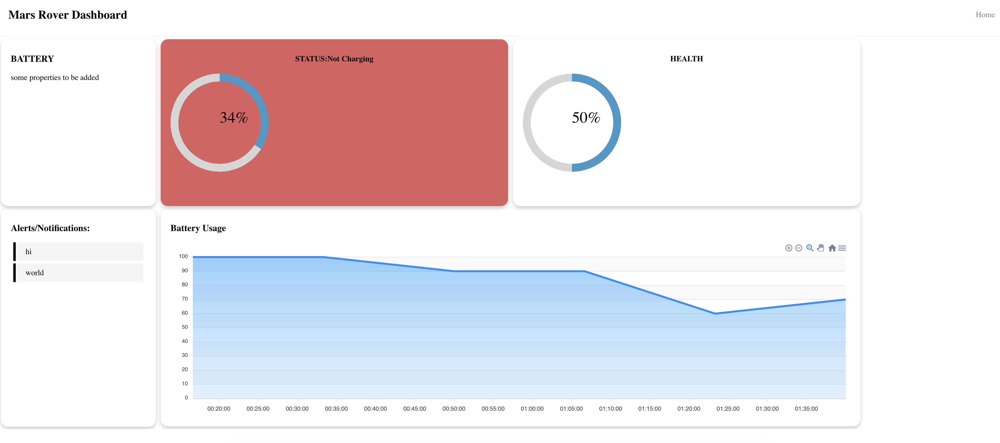
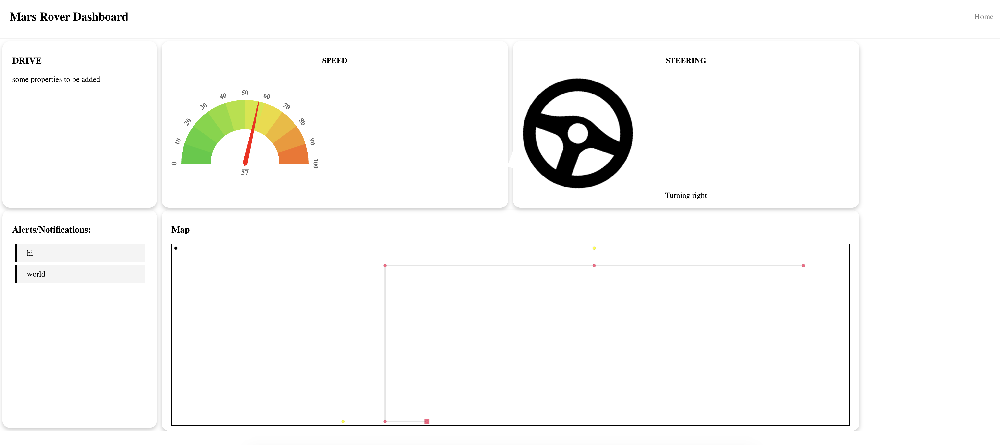
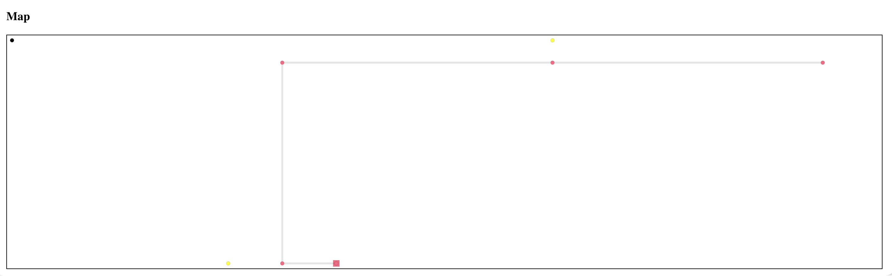
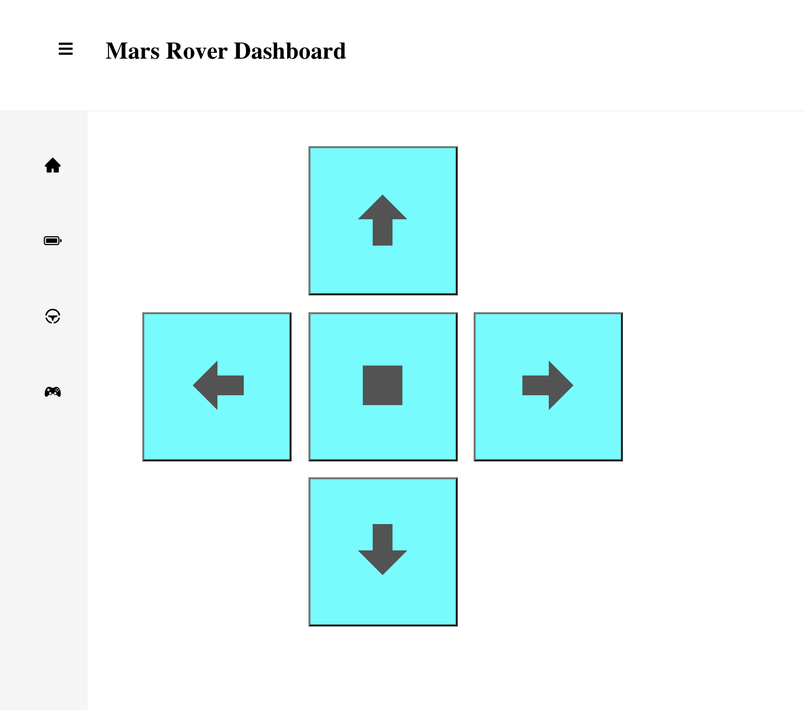

# Mars Rover Command Subsystem
The Command Subsystem consists of a client and server, which is run with React framework and Node.js respectively.

## Overview
The server would be set up on `http://localhost:5000` and the client (React dev server) would be set up on `http://localhost:3000` <br/>
Going to `http://localhost:3000` on the web browser after setting up both servers would show you 
 <br>
The two cards show information about the battery and speed represented on different meters. 

## Usage
`Node.js` is required to be installed for running the script. It can be downloaded from https://nodejs.org/en/
### Install Dependencies for Server
```
cd server 
npm install express 
npm install cors
npm install fs
npm install csv-parser
```
### Run the Node.js Server
```
cd server
node index.js
```
### Install Dependencies for Client
```
cd client
npm install 
```
### Run the React dev Client Server
``` 
cd client
npm start
```
*This is currently still in development mode. In the final product, separately starting up of the React dev Server would not be needed.

## React Client

### Overview
React is chosen as the front-end framework due to its largely supported libraries and community, also its DOM and state property. 

`src/App.js` contains the "main framework" of the webpage. <br/>
`src/Components` folder contains Javascript files for components called in `src/App.js` which are also written in React. 

The "website" has several webpages where user can jump to and contains more details of each subsystem.

### Home Page
The home page contains previews and basic details of each subsytems, clicking into each card would link to another page with more details on it. They can also bereached by clicking on the sidebar.

 <br>

Data is fetched from the server (`http://localhost:5000/data`) every 1 second and dynamically updates the webpage without reloading.

### Battery Page
The battery page, as suggested by the name, provides details on properties and information of the energy subsystem on the rover. The page is hosted on `http://localhost:3000/battery`, clicking on the `BATTERY` card on the home page will also be directed to this page.

 <br>

It contains static properties of the battery, alerts/notifications, SoC, health, and a graph on past SoC.

Data is fetched from the server (`http://localhost:5000/battery`)every 1 second and dynamically updates the webpage.

### Drive Page
The drive page provides details on the driving subsystem on the rover. The page is hosted on `http://localhost:3000/speed`, the `SPEED` card on home page is linked to this page. 

 <br>

It contains information on the speed and steering of the rover. The 2D map at the bottom contains calculated positions of obstacle, past and current positions of the rover.

 <br>

The red circles represent past pasitions of the rover, linked up with grey lines, and the red square represents the current position of the rover. Yellow circles are the obstacles and the black circle is the 'origin' (where the oprical sensor is resetted.)

Data is fetched from the server (`http://localhost:5000/drive`)every 1 second and dynamically updates the webpage.

### Controller Page
The controller page provides user interface to remotely control the rover. The page is hosted on `http://localhost:3000/controller`, the `CONTROLLER` card on home page is linked to this page.

 <br>

It has five control buttons (`left`,`right`,`forward`, `backward` and `stop`) indicated by icons to remotely control the movement of rover. The rover would be moving in the specific position once the button is clicked, a BlanchedAlmond colour of the button indicates it's being pressed.

 <br>

The button can be 'deactivated' by clicking on the button again or clicking the `stop` button at the centre.

Whenever there is a state change in the button, it would send a packet to the server (`http://localhost:5000/position`) to update its database.


## Node.js Server
Node.js is chosen as the back-end server. It acts as a two-way communication channel for data from the rover be able to display on the front-end webpage and remote command transmitted to the rover.

### HTTP Port
A HTTP port is established at port 5000 (`http://localhost:5000`), and it has 3 sub-ports that supports GET/POST on different data.

`/data` GET returns basic overview of the status of all subsystems on the rover. it is designed for the home page to fetch data. 

`/battery` GET returns details on the properties of the battery, including SoC, health and past history of SoC.

`/drive` GET returns details on the properties about the drive system, including the speed, past and current position of the rover, obstacle positions.

`/position` POST is fetched when there is a change in the position command on the webpage. It updates an array of 4 `unsigned_int8` elements (`'position'`) which indicates the remote control state. The array is in the seqeunce of [left,right,forward,backward]. Value of `1` means button being pressed on the webpage, and vice versa for `0` <br/>
For example, if the user presses "right" on the webpage, the TCP packet being sent out would be:
`[0,1,0,0]`

### Database
As all infromation on the energy subsystem is not obtained during run-time, a CSV file (`SoC_t.csv`) is stored in the server `server/data` . It will be parsed and export as array of dictionaries when `index.js` is started. 

### TCP Port
The server takes in TCP packet at port 2000, which would update its database on Battery and Speed, and reflected on the client webpage.

Input in the following format: <br/>
* battery charge: `b` + { number ∈ (0,100) }
* battery charging status: `bc` + {`c`(charging)||`n`(not charging)} 
* battery health: `h` + { number ∈ (0,100) }
* speed: `s` + { number ∈ (0,100) }
* position: `x`||`y` + { number ∈ R } 
* steering angle: `a` + { number ∈ (-180,180) }

An updated database would be printed out in the command line after a valid input.

The server would also response with the above-mentioned `unsigned_int8` array that contains information of remote control from the user on the webpage.

Due to the Request/Respone nature of server, above-mentioned array would only be sent to the client if the server receives a packet (despite being a valid input or not)

`server/TCP_index.js` contains only the TCP server extract in `server/index.js` to simplify testing on communication channels.

## Python TCP Client
A simple TCP client is set up in `server/TCPC.py`, which sends whatever user inputted to the `Node.js` server using TCP protocol. The server would then change the database accordingly. 

Input format as indicated in above section.

It would also receive and print TCP packet received from the server on the terminal.


## Future Development
1. Server receiving and updating data from control
2. Add database to server
3. Video streaming
4. Authentication/ security thing
5. Cleaning up + foramtting the interface

## Change Log
14-May-2021: initial commit <br/>
17-May-2021: added TCP socket <br/>
18-May-2021: added simple remote control buttons <br/>
24-May-2021: added battery subpage <br/>
31-May-2021: added drive subpage <br/>
01-Jun-2021: added sidebar + simple image slideshow <br/>
03-Jun-2021: added control subpage + simple database in server <br/>