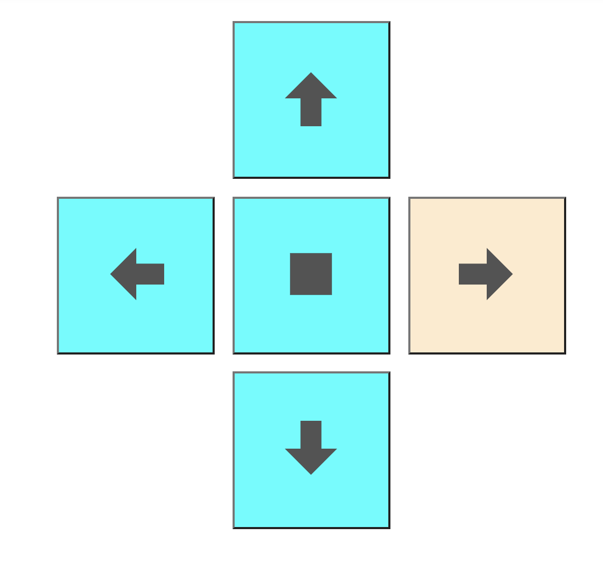

# Mars Rover Command Subsystem
The Command Subsystem consists of a client and server, which is run with React framework and Node.js respectively.

## Overview
The server would be set up on `http://localhost:5000` and the client (React dev server) would be set up on `http://localhost:3000` <br/>
Going to `http://localhost:3000` on the web browser after setting up both servers would show you 
 <br>
The two cards show information about the battery and speed represented on different meters. 

## Usage
`Node.js` is required to be installed for running the script. It can be downloaded from https://nodejs.org/en/
### Install Dependencies for Server
```
cd server 
npm install express 
npm install cors --save 
npm install readline
```
### Run the Node.js Server
```
cd server
node index.js
```
### Install Dependencies for Client
```
cd client
npm install react react-dom
npm install --save react-circular-progressbar
npm install --save react-d3-speedometer
```
### Run the React dev Client Server
``` 
cd client
npm start
```
*This is currently still in development mode. In the final product, separately starting up of the React dev Server would not be needed.

## React Client
React is chosen as the front-end framework due to its largely supported libraries and community, also its DOM and state property. 

`src/App.js` contains the "main framework" of the webpage. <br/>
`src/Components` folder contains Javascript files for components called in `src/App.js` which are also written in React. 

Data is fetched from the server (`http://localhost:5000/data`)every 1 second and dynamically updates the webpage without reloading. 

The rover can be remotely controlled by the bottom four buttons (left,right,forward, backward). The rover would be moving in the specific position as long as the button is clicked, a BlanchedAlmond colour of the button indicates it's being pressed.

 <br>

Whenever there is a state change in the button (MouseDown or MouseRelease), it would send a packet to the server to update its database.

## Node.js Server
Node.js is chosen as the back-end server. It establishs a server at port 5000 (`http://localhost:5000`). Data packet containing information on Battery and Speed would be returned if there is a fetch at subpage `/data` (which is done under the hood)

The server takes in command line input and TCP packet, which would update its database on Battery and Speed, and reflected on the client webpage.

Input in the following format: <br/>
* battery charge: `b` + { number ∈ (0,100) }
* battery charging status: `bc` + {`c`(charging)||`n`(not charging)} 
* speed: `s` + { number ∈ (0,100) }

An updated database would be printed out in the command line after a valid input.

The server would also response with an array of 4 `unsigned_int8` elements indicating the remote control state, in the sequence of [left,right,forward,backward]. Value of `1` means button being pressed on the webpage, and vice versa for `0` <br/>
For example, if the user presses "right" on the webpage, the TCP packet being sent out would be:
`[0,1,0,0]`

Due to the Request/Respone nature of server, above-mentioned array would only be sent to the client if the server receives a packet (despite being a valid input or not)

`server/TCP_index.js` contains only the TCP server extract in `server/index.js` to simplify testing on communication channels.

## Python TCP Client
A simple TCP client is set up in `server/TCPC.py`, which sends whatever user inputted to the `Node.js` server using TCP protocol. The server would then change the database accordingly. 

Input format as indicated in above section.

It would also receive and print TCP packet received from the server on the terminal.


## Future Development
1. Add map on webpage
2. Video streaming

## Change Log
14-May-2021: initial commit <br/>
17-May-2021: added TCP socket <br/>
18-May-2021: added simple remote control buttons <br/>
